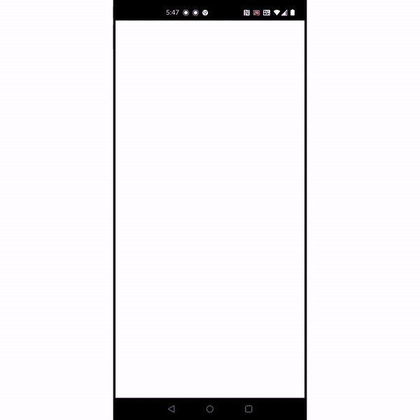

# Simple Weather Application

A simple weather application made in flutter (for learning and practice).

## Steps to run

1. Clone this repo
2. inside `lib/` create a new file - `credentials.dart`
3. Go to [https://openweathermap.org/api](https://openweathermap.org/api) and sign in to create your own api key
4. Inside `credentials.dart`, create a new constant - `const apiKey = 'your_api_key';`
5. Make sure that the value of the key is same as your api key
6. `pub get`
7. Run this project on an emulator/physical device

Huge shout-out to [Yegor Shustov](https://dribbble.com/YegorShustov) for the amazing designs!

Check out the amazing designs here - [Weather Cards](https://dribbble.com/shots/6887377-Weather-Cards)