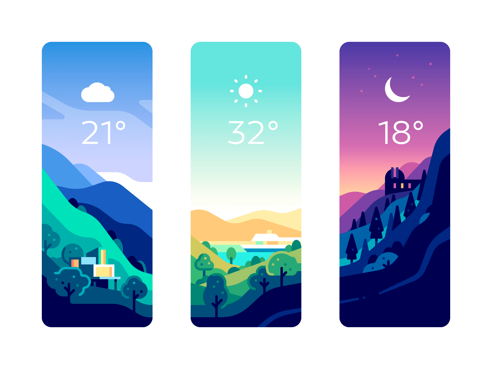

# Simple Weather Application

A simple weather application made in flutter. I have implemented the following designs from dribbble for learning purpose 😊

Huge shoutout to [YegorShustov](https://dribbble.com/YegorShustov) for the amazing designs!

Check out the amazing designs here - [Weather Cards](https://dribbble.com/shots/6887377-Weather-Cards)